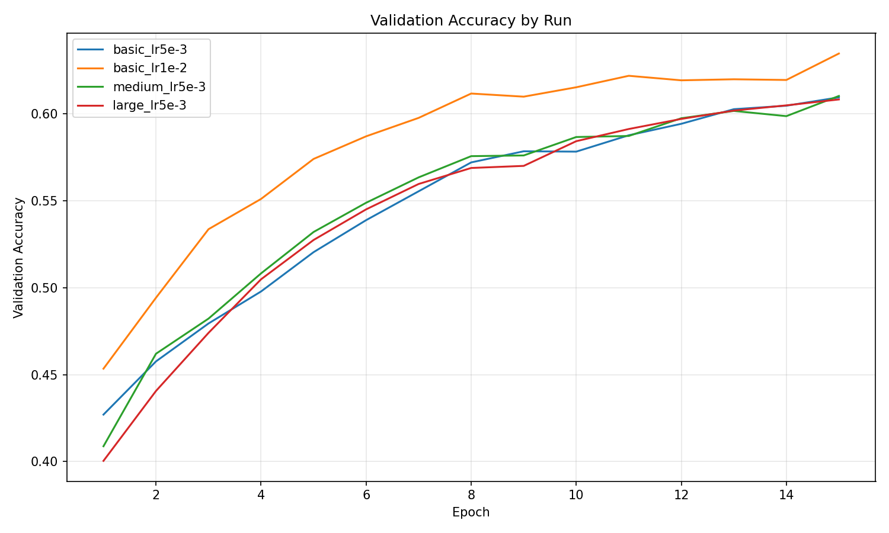
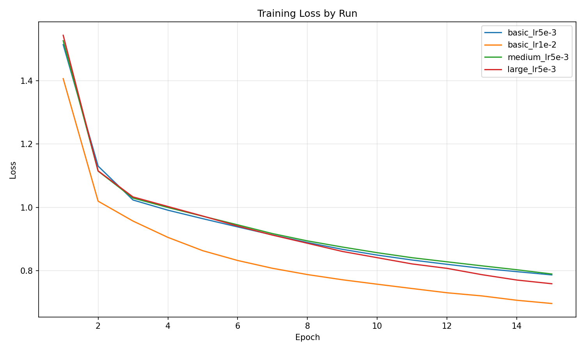

# Benchmarks

This document reports quantitative results for multiple model sizes and hyperparameters, with visual proof (curves).

## Dataset
- Source: `dataset/` (provided training files)
- Labels: `Nothing`, `Check White`, `Check Black`, `Checkmate White`, `Checkmate Black`
- Balanced sampling: 10,000 samples per label (min-count capped)
- Split: 80% train / 10% validation / 10% test
- Sizes: 40,000 train / 5,000 val / 5,000 test

## Method
For each run:
- Build model from config (basic/medium/large)
- Train with SGD (momentum + weight decay + learning-rate decay)
- Track loss, train accuracy, validation accuracy for each epoch
- Evaluate final test accuracy

## Configurations
Models:
- **basic**: 774 → 128 → 64 → 5, dropout=0.0
- **medium**: 774 → 256 → 128 → 64 → 5, dropout=0.05
- **large**: 774 → 512 → 256 → 128 → 64 → 5, dropout=0.05

Training:
- **lr5e-3**: lr=5e-3, momentum=0.9, weight_decay=1e-5, lr_decay=0.99, epochs=15
- **lr1e-2**: lr=1e-2, momentum=0.9, weight_decay=1e-5, lr_decay=0.99, epochs=15

## Results

Final metrics (train/val/test):
| Run | Hidden | Dropout | Train Acc | Val Acc | Test Acc | Final Loss |
|---|---|---|---|---|---|---|
| basic_lr5e-3 | 128-64 | 0.00 | 0.6480 | 0.6094 | 0.6112 | 0.7868 |
| basic_lr1e-2 | 128-64 | 0.00 | 0.7123 | 0.6346 | 0.6364 | 0.6965 |
| medium_lr5e-3 | 256-128-64 | 0.05 | 0.6670 | 0.6102 | 0.6152 | 0.7896 |
| large_lr5e-3 | 512-256-128-64 | 0.05 | 0.6933 | 0.6082 | 0.6222 | 0.7589 |

### Validation Accuracy Curve

### Training Loss Curve

### Interpretation
The curves show steady learning for all runs, then a plateau on validation accuracy. The simplest model with a higher learning rate reaches the best validation score, which matches the code’s straightforward MLP design and indicates that bigger models are not helping here. Training loss keeps dropping while validation stalls, so more epochs alone are unlikely to improve results without changing data or the training setup.

## Notes
- All metrics are computed using the `my_torch` library only.
- Balanced sampling ensures each label is equally represented in train/val/test.
